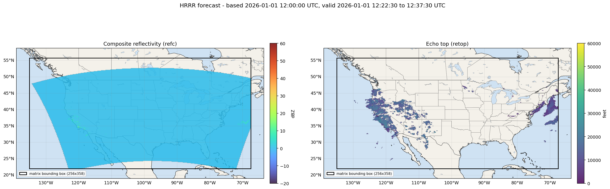

# Weather data: file format

You're getting two kinds of files. Together they describe the weather over the continental United States: where there's precipitation, how heavy it is, and how high it goes.

- **`refc/...`** — **composite reflectivity** (in dBZ): a measurement, made by weather radar, of how much precipitation (rain, snow, hail) is in a vertical column of air at each location. Higher = heavier weather. "Composite" means this is the maximum value across all altitudes in that column, so a single number per location.
- **`retop/...`** — **echo top**: the *altitude* (height) of the top of the precipitation column. "Echo" is the radar's bounce-back; "echo top" is the highest point where the radar still detects precipitation. Tall echo tops indicate tall storms.

You can think of `refc` as the top-down view ("there's heavy rain here, light rain there") and `retop` as the side view ("the storm here goes up to 30,000 feet"). Combined, they give a rough 3D picture.

Weather at a given location doesn't affect a flight if the flight's altitude is higher than the local echo top (`retop`), or if the local composite reflectivity (`refc`) is too low. For this task we assume `< 40 dBZ` is fine.

## Glossary

- **Forecast** — a prediction of future weather. The data tells you what the weather *will be* (or was predicted to be) at a future moment.
- **dBZ** ("decibels of Z") — the unit weather radar uses for reflectivity. It's logarithmic, so the absolute number isn't intuitive. Rule of thumb:
  - **`< 0` dBZ** — clear / no precipitation
  - **`~20` dBZ** — light rain
  - **`~40` dBZ** — heavy rain
  - **`50–60+` dBZ** — severe storms, possibly hail
- **UTC** — a timezone (effectively the same as GMT). All timestamps in this data are UTC.
- **HRRR** — *High-Resolution Rapid Refresh*, the name of the NOAA weather forecast model that `refc` and `retop` files come from. It runs once an hour and forecasts up to ~18 hours ahead.

## Filename

```
{based_at}_{valid_from}_{valid_to}.npz
```

All three are UTC timestamps in `YYYY-MM-DD_HH:MM:SS` format.

- **`based_at`** — when the forecast was *computed*. Older `based_at` = older prediction.
- **`valid_from` / `valid_to`** — the 15-minute window the data describes. The forecast says "during this window, the weather will look like this."

## What's inside the file

Each `.npz` contains a single 2D array under the key `'matrix'`:

```python
import numpy as np
data = np.load("refc/2026-01-01_12:00:00_2026-01-01_12:22:30_2026-01-01_12:37:30.npz")
m = data["matrix"]      # shape (256, 358), dtype float64
```

| | refc (composite reflectivity) | retop (echo top) |
|---|---|---|
| What it is | precipitation intensity per location | top altitude of the precipitation column |
| Units | dBZ (see glossary) | feet |
| Typical range | -20 to ~60 (higher = more intense) | 0 to ~60,000 ft |
| Mask nodata | `m <= -50` | `m < 0` |

## Shape and orientation

The array shape is `(256, 358)` — i.e. 256 rows × 358 columns.

- **Rows** go **north → south** (row `0` is the northernmost row of pixels).
- **Columns** go **west → east** (column `0` is the westernmost).
- `matrix[i, j]` is the value at row `i`, column `j`.

## Geographic coverage

The matrix is on a **regular equirectangular lat/lon grid** (cells uniformly spaced in latitude and longitude) with these corners:

| | min | max |
|---|---|---|
| Latitude | 21.943°N | 55.7765°N |
| Longitude | -135.0°E | -67.5°E |

The bounding box is wider than the area with actual data — cells outside the forecast footprint (roughly the contiguous US) carry the nodata sentinel.



*Example: black rectangle = the matrix bounding box (256×358 cells); the colored region inside is where the data lives. The slanted edges of the data region are not a bug — they are the actual shape of the forecast's coverage area in lat/lon coordinates.*

Top-left corner coordinates of pixel `[i, j]`:

```python
LAT_MIN, LAT_MAX = 21.943, 55.7765
LON_MIN, LON_MAX = -135.0, -67.5
ROWS, COLS = 256, 358

def pixel_top_left_latlon(i: int, j: int) -> tuple[float, float]:
    lat = LAT_MAX - i / ROWS * (LAT_MAX - LAT_MIN)
    lon = LON_MIN + j / COLS * (LON_MAX - LON_MIN)
    return lat, lon
```

## Plotting example

```python
import numpy as np
import matplotlib.pyplot as plt

m = np.load("refc/.../...npz")["matrix"]
m = np.where(m <= -50, np.nan, m)   # mask nodata

plt.imshow(
    m,
    extent=[-135.0, -67.5, 21.943, 55.7765],   # [lon_min, lon_max, lat_min, lat_max]
    origin="upper",                            # row 0 is north
    vmin=-20, vmax=60, cmap="turbo",
)
plt.colorbar(label="Composite reflectivity (dBZ)")
plt.xlabel("Longitude"); plt.ylabel("Latitude")
plt.show()
```

For `retop`, swap to a height colormap and adjust `vmin/vmax` (e.g. `0` to `60000` feet) — and mask negative values as nodata.

If you want country/state outlines drawn on top, look at the `cartopy` library or load a US states GeoJSON and overlay it.

## Layout: forward strips per asked_at timestamp

Two timestamps show up in this layout:

- **`asked_at`** (directory name) — the timestamp of each task in this challenge.
- **`based_at`** (filenames) — when the forecast was produced.

`based_at ≤ asked_at`, typically `asked_at` floored to the full hour.

Each per-asked_at subdirectory (e.g. `asked_at_2026-01-01T12:30:00Z/refc/...` and `.../retop/...`) holds all the 15-min strips of a single forecast covering your asked_at timestamp. The strips are consecutive and extend ~18 hours forward. Sort by `valid_from` to walk the forecast forward in time.
